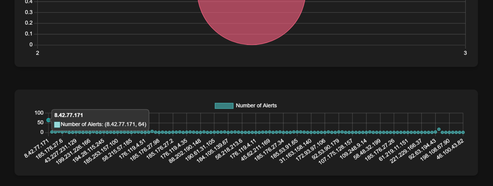

<h1 align="center"> WiJungle </h1>

## Live Link:

    https://wijungle.netlify.app/

### OBJECTIVE :

* This project is a React-based dashboard that visualizes data from a backend server. It includes multiple graphs to represent different aspects of the data.

  

### FEATURES LIST :

1. **Visualization** : Visualizes data using various types of graphs (line chart, pie chart, bar chart).
2. **Theme** : Dark-themed dashboard for better visibility and aesthetics.
3. **Responsive** : Responsive design for use on different devices.

### Run Scripts

```Terminal
git clone https://github.com/shhiivvaam/wijungle.git

cd wijungle
npm install
npm start
```

Thank you for visiting!
